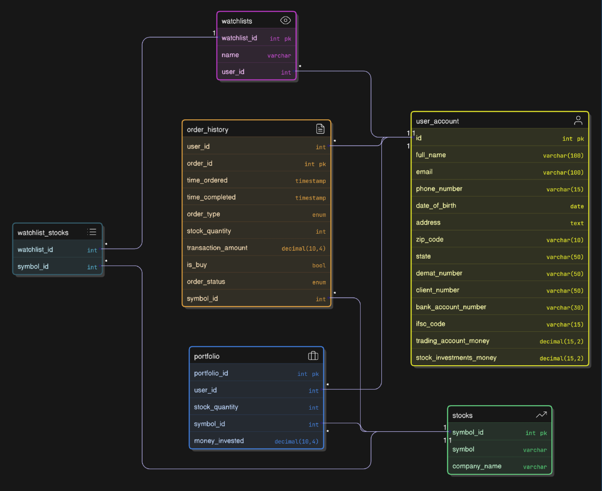

# Stock Overflow - Backend

A robust Spring Boot backend service providing REST APIs for the Stocks Overflow trading platform, with MySQL database integration and comprehensive market data management.

## 🚀 Features

- **RESTful API** - Comprehensive endpoints for trading operations
- **MySQL Database** - Reliable data persistence and management
- **User Authentication** - Secure user registration and login
- **Portfolio Management** - Real-time portfolio tracking and analytics
- **Order Processing** - Buy/sell order execution and management
- **Market Data Integration** - Live stock prices and market information
- **Wallet Management** - Fund deposits, withdrawals, and balance tracking
- **Watchlist System** - Personal stock monitoring capabilities

## 📸 Architecture Overview


*Database schema and relationships*

## 🛠️ Prerequisites

Before you begin, make sure you have the following installed:

- **Java 17** (tested with `openjdk 17.0.15 LTS`)
    ```bash
    java -version
    javac -version
    ```
- **MySQL 8.0.43** (or 8.0.40 should also work)
    ```bash
    mysql --version
    ```
- **Maven** (comes bundled with IntelliJ or can be installed separately)
    ```bash
    mvn -v
    ```
- **IntelliJ IDEA** or **VS Code** (recommended IDEs)
- **Git** (for cloning the repository)
- **Docker & Docker Compose** (optional, for containerized setup)

> **Note**: This backend service is designed to work with the [Stocks Overflow Frontend](https://github.com/sachinprasanna7/StockOverflow-frotend). After starting the backend servers, ensure the frontend servers are running to leverage full capability of the project.

## 📦 Installation & Setup

### Step 1: Clone the Repository

```bash
# Clone the repository
git clone <repository-url>
cd StockOverflow-backend

# Verify project structure
ls -la
```

### Step 2: Configure MySQL Database

#### 2.1 Start MySQL Server
```bash
# Start MySQL service (varies by OS)
# Ubuntu/Debian:
sudo systemctl start mysql

# macOS (with Homebrew):
brew services start mysql

# Windows: Start MySQL from Services or MySQL Workbench
```

#### 2.2 Setup Database Schema
```bash
# Open MySQL Workbench or connect via command line
mysql -u root -p

# Load and execute the provided SQL script
source database/database_stocks.sql
```

> **Note**: The `database/database_stocks.sql` script contains all necessary database setup including database creation, user setup, and initial schema.


### Step 3: Install Dependencies

```bash
# Install Maven dependencies
./mvnw clean install

# Or if using system Maven
mvn clean install
```

# Step 4: Configure `.env` Files

This project uses **two separate** `.env` files — one for the Spring Boot backend and one for the Python scripts. Both store sensitive credentials and **must be added to** `.gitignore`.

## 4.1 `.env` for Spring Boot Backend

**Location:** `StockOverflowBackend/.env` (same folder as `pom.xml`)

```env
# Database Configuration (Spring Boot)
DB_USER=stockoverflow_user
DB_PASSWORD=your_secure_password
```

In `application.properties` (inside `src/main/resources`):

```properties
spring.datasource.username=${DB_USER}
spring.datasource.password=${DB_PASSWORD}
```

## 4.2 `.env` for Python Scripts

**Location:** `python_scripts/load/.env`

```env
# Database Configuration (Python Script)
DB_USER=stockoverflow_user
DB_PASSWORD=your_secure_password
```

## Note

Keep `.env` files private by adding them to `.gitignore`:

```bash
**/.env
```

Each `.env` is independent so changes in one will not affect the other.


## 🚀 Running the Application

### Option 1: Docker (Recommended)

The easiest way to run the backend with MySQL is using Docker Compose:

#### Prerequisites for Docker
- **Docker** installed and running
- **Docker Compose** installed

#### Steps to Run with Docker

```bash
# Build and start all services
docker-compose up --build

# Or run in detached mode (background)
docker-compose up -d --build

# View logs
docker-compose logs backend
```

#### Docker Services
The `compose.yaml` includes:
- **MySQL Database** - Port 3306 (internal)
- **Spring Boot Backend** - Port 8080
- **Automated database initialization**

#### Docker Commands

```bash
# Start services
docker-compose up

# Start in background
docker-compose up -d

# Stop services
docker-compose down

# Rebuild and start
docker-compose up --build

# View all logs
docker-compose logs

# View backend logs only
docker-compose logs backend

# Access MySQL container
docker-compose exec mysql mysql -u root -p
```

### Option 2: Manual Setup (Development)

For development or manual setup:

#### Using IntelliJ IDEA [HIGHLY RECOMMENDED OVER VSCODE]

1. **Open Project**
   - Open IntelliJ IDEA
   - Click "Open" and select the project directory
   - Wait for Maven to download dependencies

2. **Configure Run Configuration**
   - Navigate to `src/main/java/com/stockoverflow/BackendApplication.java`
   - Click the green run button next to the main method
   - Or right-click and select "Run 'BackendApplication'"

3. **Verify Startup**
   - Check console for successful startup messages
   - Backend should be running on `http://localhost:8080`

#### Using VS Code

1. **Install Extensions**
   - Install "Extension Pack for Java"
   - Install "Spring Boot Extension Pack"

2. **Open Project**
   ```bash
   code .
   ```

3. **Run Application**
   - Use Spring Boot Dashboard
   - Or run in terminal:
   ```bash
   ./mvnw spring-boot:run
   ```

#### Using Command Line

```bash
# Run with Maven wrapper
./mvnw spring-boot:run

# Or with system Maven
mvn spring-boot:run

# Run with specific profile
./mvnw spring-boot:run -Dspring-boot.run.profiles=dev
```

## 🔧 Configuration

### Application Properties

Key configuration in `src/main/resources/application.properties`:

```properties
# Server Configuration
server.port=8080

# Database Configuration
spring.datasource.url=jdbc:mysql://${DB_HOST:localhost}:${DB_PORT:3306}/${DB_NAME:stockoverflow_db}
spring.datasource.username=${DB_USERNAME:stockoverflow_user}
spring.datasource.password=${DB_PASSWORD:your_password}

# JPA/Hibernate Configuration
spring.jpa.hibernate.ddl-auto=update
spring.jpa.show-sql=false
spring.jpa.properties.hibernate.dialect=org.hibernate.dialect.MySQL8Dialect

# CORS Configuration
cors.allowed.origins=http://localhost:3000
```

### API Endpoints

Once running, the following endpoints are available:

- **Base URL**: `http://localhost:8080/api`
- **Health Check**: `GET /actuator/health`
- **API Documentation**: `http://localhost:8080/swagger-ui.html` 

## 🧪 Testing the API

### Health Check
```bash
# Test if backend is running
curl http://localhost:8080/actuator/health
```


## 🐛 Troubleshooting

### Docker Issues

**Docker Build Fails**
- Ensure Docker is running: `docker --version`
- Clean Docker cache: `docker system prune`
- Rebuild without cache: `docker-compose build --no-cache`

**Database Connection Issues in Docker**
- Check if containers are running: `docker-compose ps`
- View MySQL logs: `docker-compose logs mysql`
- Verify network connectivity: `docker-compose exec backend ping mysql`

**Port Conflicts**
- Check if port 8080 is in use: `netstat -tulpn | grep 8080`
- Stop conflicting services or change port in `compose.yaml`

### Manual Setup Issues

**"Cannot connect to database" Error**
- Verify MySQL server is running: `sudo systemctl status mysql`
- Check database exists: `mysql -u root -p -e "SHOW DATABASES;"`
- Verify credentials in `.env` file
- Test connection: `mysql -u stockoverflow_user -p stockoverflow_db`

**Maven Build Issues**
- Clean and rebuild: `./mvnw clean install`
- Check Java version: `java -version` (should be Java 17)
- Clear Maven cache: `rm -rf ~/.m2/repository`

**Application Won't Start**
- Check port availability: `lsof -i :8080`
- Verify environment variables are loaded
- Check application logs for specific error messages

**CORS Issues with Frontend**
- Verify `cors.allowed.origins` in `application.properties`
- Check frontend is running on `http://localhost:3000`
- Add additional origins if needed

### Database Issues

**Table Creation Problems**
- Check Hibernate DDL setting: `spring.jpa.hibernate.ddl-auto=update`
- Manually create tables if needed
- Verify MySQL user has CREATE privileges

**Performance Issues**
- Enable SQL logging: `spring.jpa.show-sql=true`
- Check database indexes
- Monitor connection pool settings


## 📞 Contributors

- Khushi Suresh Muddi
- Prerak Varshney
- Sruthi R
- Sachin Prasanna

---
